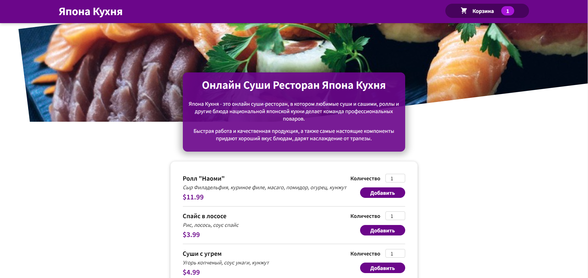

<h1> Japanes  Magazine</h1>

 

 <h3><a href="https://mike14112.github.io/japanes/" target="_blank" style="text-decoration:border-none; color:white;">Link Web site </a> </h3>

<h3>
Hi! This project is a simulation of an online sushi store where I used React.</h3>

   <h2> The technologies I used </h2>

<h3>

</h3>

<h2> Installation Guide</h2>

<h3> git clone https://github.com/mike14112/japanes.git    
npm install    
npm start
</h3>

